# AI 工作台 · 数据库实体关系图（ER Diagram）

```mermaid
erDiagram

    %% ══════════════════════════════════════════
    %% 系统 / 外部依赖
    %% ══════════════════════════════════════════
    Auto_Users {
        bigint      id              PK
        varchar     username
        varchar     email
        varchar     password_hash
        tinyint     is_active
        datetime    created_at
        datetime    updated_at
    }

    Auto_TestCaseProjects {
        bigint      id              PK
        varchar     name
        varchar     description
        tinyint     is_active
        datetime    created_at
    }

    %% ══════════════════════════════════════════
    %% AI 用例工作台核心
    %% ══════════════════════════════════════════
    Auto_AiCaseWorkspaces {
        bigint      id                      PK
        varchar     workspace_key           "唯一标识"
        varchar     name
        bigint      project_id              FK
        longtext    requirement_text
        longtext    requirement_embedding
        tinyint     is_knowledge_base
        decimal     quality_score
        json        map_data
        varchar     status
        int         version
        int         total_cases
        bigint      created_by              FK
        bigint      updated_by              FK
        datetime    created_at
        datetime    updated_at
    }

    Auto_AiCaseNodeExecutions {
        bigint      id                  PK
        bigint      workspace_id        FK
        varchar     node_id
        varchar     node_topic
        varchar     previous_status
        varchar     current_status
        bigint      operator_id         FK
        text        comment
        datetime    created_at
    }

    Auto_AiCaseNodeAttachments {
        bigint      id                  PK
        bigint      workspace_id        FK
        varchar     node_id
        bigint      execution_log_id    FK
        varchar     file_name
        varchar     storage_key
        bigint      uploaded_by         FK
        datetime    created_at
    }

    %% ══════════════════════════════════════════
    %% 需求解析模块
    %% ══════════════════════════════════════════
    Auto_AiRequirementParseTasks {
        bigint      id              PK
        varchar     task_key        "唯一标识"
        varchar     task_no
        bigint      workspace_id    FK
        varchar     title
        varchar     product_line
        varchar     priority
        longtext    raw_text
        longtext    cleaned_text
        varchar     status
        int         progress
        varchar     current_stage
        bigint      created_by      FK
        bigint      updated_by      FK
        datetime    created_at
        datetime    updated_at
    }

    Auto_AiRequirementAttachments {
        bigint      id                  PK
        bigint      task_id             FK
        varchar     file_key
        varchar     original_file_name
        varchar     extract_status
        longtext    extracted_text
        bigint      uploaded_by         FK
        datetime    created_at
    }

    Auto_AiRequirementCleaningRules {
        bigint      id                  PK
        varchar     rule_code
        varchar     rule_name
        text        description
        tinyint     enabled_by_default
        int         sort_order
        tinyint     is_active
        datetime    created_at
    }

    Auto_AiRequirementTaskCleaningRules {
        bigint      id              PK
        bigint      task_id         FK
        bigint      rule_id         FK
        tinyint     enabled
        tinyint     applied
        int         changed_count
        datetime    created_at
    }

    Auto_AiRequirementParseConfigs {
        bigint      id                      PK
        bigint      task_id                 FK
        tinyint     generate_summary
        tinyint     scan_ambiguity_risk
        tinyint     generate_test_points
        varchar     model_name
        decimal     temperature
        int         max_tokens
        datetime    created_at
        datetime    updated_at
    }

    %% ══════════════════════════════════════════
    %% 解析结果 & 日志
    %% ══════════════════════════════════════════
    Auto_AiRequirementParseStageLogs {
        bigint      id              PK
        bigint      task_id         FK
        varchar     stage_code
        varchar     stage_name
        varchar     status
        int         progress
        datetime    started_at
        datetime    completed_at
        int         duration_ms
        text        error_message
    }

    Auto_AiRequirementParseResults {
        bigint      id              PK
        bigint      task_id         FK
        text        summary
        text        business_goal
        json        user_roles
        json        structured_json
        varchar     ai_model
        datetime    created_at
        datetime    updated_at
    }

    Auto_AiRequirementModules {
        bigint      id                  PK
        bigint      task_id             FK
        varchar     module_key
        varchar     module_name
        varchar     business_priority
        decimal     confidence_score
        int         sort_order
        datetime    created_at
    }

    Auto_AiRequirementItems {
        bigint      id                      PK
        bigint      task_id                 FK
        bigint      module_id               FK
        varchar     requirement_code
        varchar     requirement_type
        varchar     title
        text        description
        text        acceptance_criteria
        varchar     priority
        decimal     confidence_score
        datetime    created_at
        datetime    updated_at
    }

    Auto_AiRequirementQuestions {
        bigint      id                      PK
        bigint      task_id                 FK
        bigint      requirement_item_id     FK
        varchar     question_type
        text        question_content
        varchar     severity
        varchar     status
        bigint      answered_by             FK
        text        answer_content
        datetime    created_at
        datetime    updated_at
    }

    Auto_AiRequirementRisks {
        bigint      id                      PK
        bigint      task_id                 FK
        bigint      requirement_item_id     FK
        varchar     risk_type
        varchar     risk_title
        text        risk_description
        varchar     severity
        varchar     possibility
        varchar     status
        datetime    created_at
    }

    Auto_AiRequirementTestPointSuggestions {
        bigint      id                      PK
        bigint      task_id                 FK
        bigint      module_id               FK
        bigint      requirement_item_id     FK
        varchar     test_point_title
        text        test_point_description
        varchar     test_type
        varchar     priority
        varchar     status
        bigint      converted_workspace_id  FK
        datetime    created_at
        datetime    updated_at
    }

    Auto_AiRequirementModelCallLogs {
        bigint      id              PK
        bigint      task_id         FK
        varchar     stage_code
        varchar     model_name
        int         request_tokens
        int         response_tokens
        int         total_tokens
        int         latency_ms
        varchar     status
        text        error_message
        datetime    created_at
    }

    %% ══════════════════════════════════════════
    %% 关系定义
    %% ══════════════════════════════════════════

    %% 系统/项目 → 工作台
    Auto_Users                              ||--o{ Auto_AiCaseWorkspaces                      : "creates/updates"
    Auto_TestCaseProjects                   ||--o{ Auto_AiCaseWorkspaces                      : "belongs to"

    %% 工作台核心关系
    Auto_AiCaseWorkspaces                   ||--o{ Auto_AiCaseNodeExecutions                  : "1:N workspace_id"
    Auto_AiCaseWorkspaces                   ||--o{ Auto_AiCaseNodeAttachments                 : "1:N workspace_id"
    Auto_AiCaseNodeExecutions               ||--o{ Auto_AiCaseNodeAttachments                 : "1:N execution_log_id"
    Auto_Users                              ||--o{ Auto_AiCaseNodeExecutions                  : "operator_id"
    Auto_Users                              ||--o{ Auto_AiCaseNodeAttachments                 : "uploaded_by"

    %% 工作台 → 需求解析任务
    Auto_AiCaseWorkspaces                   ||--o{ Auto_AiRequirementParseTasks               : "1:N workspace_id"
    Auto_Users                              ||--o{ Auto_AiRequirementParseTasks               : "creates"

    %% 需求解析任务 → 子表
    Auto_AiRequirementParseTasks            ||--o{ Auto_AiRequirementAttachments              : "1:N task_id"
    Auto_AiRequirementParseTasks            ||--|| Auto_AiRequirementParseConfigs             : "1:1 task_id"
    Auto_AiRequirementParseTasks            ||--o{ Auto_AiRequirementTaskCleaningRules        : "1:N task_id"
    Auto_AiRequirementParseTasks            ||--o{ Auto_AiRequirementParseStageLogs           : "1:N task_id"
    Auto_AiRequirementParseTasks            ||--|| Auto_AiRequirementParseResults             : "1:1 task_id"
    Auto_AiRequirementParseTasks            ||--o{ Auto_AiRequirementModules                  : "1:N task_id"
    Auto_AiRequirementParseTasks            ||--o{ Auto_AiRequirementItems                    : "1:N task_id"
    Auto_AiRequirementParseTasks            ||--o{ Auto_AiRequirementQuestions                : "1:N task_id"
    Auto_AiRequirementParseTasks            ||--o{ Auto_AiRequirementRisks                    : "1:N task_id"
    Auto_AiRequirementParseTasks            ||--o{ Auto_AiRequirementTestPointSuggestions     : "1:N task_id"
    Auto_AiRequirementParseTasks            ||--o{ Auto_AiRequirementModelCallLogs            : "1:N task_id"

    %% 清洗规则字典 → 关联表
    Auto_AiRequirementCleaningRules         ||--o{ Auto_AiRequirementTaskCleaningRules        : "1:N rule_id"

    %% 模块 → 需求点 / 测试点
    Auto_AiRequirementModules               ||--o{ Auto_AiRequirementItems                    : "1:N module_id"
    Auto_AiRequirementModules               ||--o{ Auto_AiRequirementTestPointSuggestions     : "1:N module_id"

    %% 需求点 → 疑问 / 风险 / 测试点
    Auto_AiRequirementItems                 ||--o{ Auto_AiRequirementQuestions                : "1:N requirement_item_id"
    Auto_AiRequirementItems                 ||--o{ Auto_AiRequirementRisks                    : "1:N requirement_item_id"
    Auto_AiRequirementItems                 ||--o{ Auto_AiRequirementTestPointSuggestions     : "1:N requirement_item_id"

    %% 用户 → 疑问（回答者）
    Auto_Users                              ||--o{ Auto_AiRequirementQuestions                : "answers"

    %% 测试点建议 → 工作台（转换）
    Auto_AiRequirementTestPointSuggestions  }o--|| Auto_AiCaseWorkspaces                     : "convert to workspace"
```

---

## 说明

### 表分组

| 分组 | 表名 | 说明 |
|------|------|------|
| 系统/外部 | `Auto_Users` | 系统用户 |
| 系统/外部 | `Auto_TestCaseProjects` | 测试项目 |
| AI 用例工作台 | `Auto_AiCaseWorkspaces` | 工作台主表 |
| AI 用例工作台 | `Auto_AiCaseNodeExecutions` | 节点状态变更流水 |
| AI 用例工作台 | `Auto_AiCaseNodeAttachments` | 节点附件/截图 |
| 需求解析 | `Auto_AiRequirementParseTasks` | 解析任务主表 |
| 需求解析 | `Auto_AiRequirementAttachments` | 需求附件 |
| 需求解析 | `Auto_AiRequirementCleaningRules` | 清洗规则字典 |
| 需求解析 | `Auto_AiRequirementTaskCleaningRules` | 任务清洗规则关联 |
| 需求解析 | `Auto_AiRequirementParseConfigs` | 解析配置 |
| 需求解析 | `Auto_AiRequirementItems` | 结构化需求点 |
| 解析结果 | `Auto_AiRequirementParseStageLogs` | 解析阶段日志 |
| 解析结果 | `Auto_AiRequirementParseResults` | 解析结果摘要 |
| 解析结果 | `Auto_AiRequirementModules` | 功能模块 |
| 解析结果 | `Auto_AiRequirementQuestions` | 需求疑问 |
| 解析结果 | `Auto_AiRequirementRisks` | 风险提示 |
| 解析结果 | `Auto_AiRequirementTestPointSuggestions` | 测试点建议（可转换→工作台） |
| 解析结果 | `Auto_AiRequirementModelCallLogs` | AI 模型调用日志 |

### 关系符号说明

| 符号 | 含义 |
|------|------|
| `\|\|--o{` | 一对多（强制 → 零或多） |
| `\|\|--\|\|` | 一对一（强制 → 强制） |
| `}o--\|\|` | 多对一（零或多 → 强制） |
